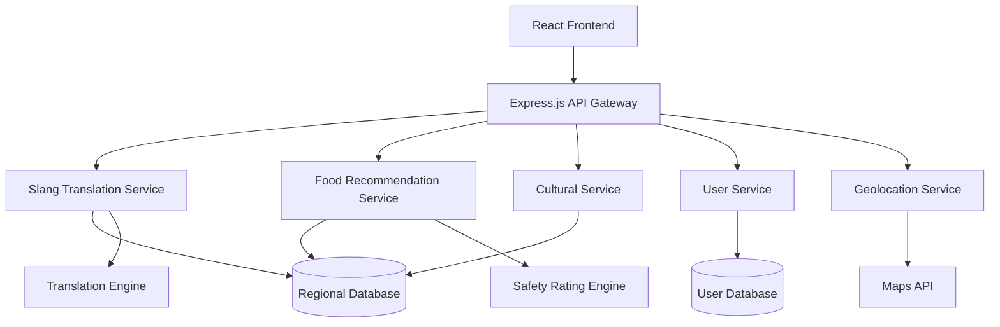

# Design Document: Indian Local Guide

## Overview

The Indian Local Guide is a web-based application that provides cultural assistance through slang translation and street food recommendations. The system uses a modular architecture with separate services for translation, food recommendations, and cultural information, all backed by a comprehensive regional database.

The application will be built using TypeScript for type safety and maintainability, with a React frontend and Node.js backend. The system emphasizes accuracy, cultural sensitivity, and user experience while providing reliable, location-aware recommendations.

## Architecture

### High-Level Architecture



### Service Architecture

The system follows a microservices-inspired architecture with clear separation of concerns:

- **API Gateway**: Central routing and authentication
- **Slang Translation Service**: Handles bidirectional translation with context
- **Food Recommendation Service**: Location-based food suggestions with safety ratings
- **Cultural Service**: Regional customs, festivals, and cultural information
- **User Service**: Preferences, favorites, and personalization
- **Geolocation Service**: Location detection and city mapping

## Components and Interfaces

### Core Components

#### 1. Slang Translation Service
```typescript
interface SlangTranslationService {
  translateToEnglish(text: string, region?: string): Promise<TranslationResult>
  translateToHindi(text: string, targetRegion?: string): Promise<TranslationResult>
  getRegionalVariations(term: string): Promise<RegionalVariation[]>
  searchSimilarTerms(query: string): Promise<SlangTerm[]>
}

interface TranslationResult {
  translation: string
  context: 'formal' | 'casual' | 'slang'
  confidence: number
  regionalVariations?: RegionalVariation[]
  usageExamples: string[]
}
```

#### 2. Food Recommendation Service
```typescript
interface FoodRecommendationService {
  getRecommendations(location: Location, preferences: FoodPreferences): Promise<FoodRecommendation[]>
  getFoodByCategory(category: string, location: Location): Promise<FoodRecommendation[]>
  getPopularHubs(city: string): Promise<FoodHub[]>
  rateSafety(vendorId: string): Promise<SafetyRating>
}

interface FoodRecommendation {
  name: string
  description: string
  location: Location
  safetyRating: SafetyRating
  priceRange: PriceRange
  dietaryInfo: DietaryInfo
  bestTime: string
  hygieneNotes: string[]
}
```

#### 3. Cultural Service
```typescript
interface CulturalService {
  getRegionalInfo(region: string): Promise<RegionalInfo>
  getFestivalInfo(festival: string): Promise<FestivalInfo>
  getEtiquetteGuide(context: string): Promise<EtiquetteGuide>
  getBargainingTips(location: Location): Promise<BargainingTip[]>
}
```

#### 4. User Service
```typescript
interface UserService {
  savePreferences(userId: string, preferences: UserPreferences): Promise<void>
  getFavorites(userId: string): Promise<Favorite[]>
  addFavorite(userId: string, item: FavoriteItem): Promise<void>
  getRecommendationHistory(userId: string): Promise<RecommendationHistory[]>
}
```

### API Endpoints

#### Translation Endpoints
- `POST /api/translate/to-english` - Translate slang to English
- `POST /api/translate/to-hindi` - Translate English to Hindi/regional
- `GET /api/translate/variations/:term` - Get regional variations
- `GET /api/translate/search?q=:query` - Search similar terms

#### Food Recommendation Endpoints
- `GET /api/food/recommendations?lat=:lat&lng=:lng` - Get location-based recommendations
- `GET /api/food/category/:category?lat=:lat&lng=:lng` - Get food by category
- `GET /api/food/hubs/:city` - Get popular food hubs
- `GET /api/food/safety/:vendorId` - Get safety rating

#### Cultural Information Endpoints
- `GET /api/culture/region/:region` - Get regional information
- `GET /api/culture/festival/:festival` - Get festival information
- `GET /api/culture/etiquette/:context` - Get etiquette guidelines
- `GET /api/culture/bargaining?lat=:lat&lng=:lng` - Get bargaining tips

## Data Models

### Core Data Models

#### Slang Translation Models
```typescript
interface SlangTerm {
  id: string
  term: string
  language: 'hindi' | 'english' | 'regional'
  region: string
  translations: Translation[]
  context: 'formal' | 'casual' | 'slang'
  popularity: number
  usageExamples: string[]
}

interface Translation {
  text: string
  targetLanguage: string
  context: string
  confidence: number
}

interface RegionalVariation {
  region: string
  variation: string
  usage: string
}
```

#### Food Recommendation Models
```typescript
interface FoodItem {
  id: string
  name: string
  description: string
  category: string
  region: string
  ingredients: string[]
  dietaryInfo: DietaryInfo
  preparationTime: string
  spiceLevel: 'mild' | 'medium' | 'hot' | 'very-hot'
}

interface FoodVendor {
  id: string
  name: string
  location: Location
  foodItems: string[]
  safetyRating: SafetyRating
  priceRange: PriceRange
  operatingHours: OperatingHours
  hygieneNotes: string[]
}

interface SafetyRating {
  overall: number // 1-5 scale
  hygiene: number
  freshness: number
  popularity: number
  lastUpdated: Date
  reviewCount: number
}
```

#### Cultural Models
```typescript
interface RegionalInfo {
  region: string
  languages: string[]
  customs: Custom[]
  festivals: Festival[]
  etiquette: EtiquetteRule[]
  transportation: TransportationInfo
}

interface Festival {
  name: string
  date: string
  significance: string
  celebrations: string[]
  regions: string[]
  dosDonts: string[]
}
```

#### User Models
```typescript
interface UserPreferences {
  dietaryRestrictions: string[]
  spicePreference: 'mild' | 'medium' | 'hot' | 'very-hot'
  preferredRegions: string[]
  languagePreference: string
  budgetRange: PriceRange
}

interface Favorite {
  id: string
  type: 'slang' | 'food' | 'cultural'
  itemId: string
  dateAdded: Date
  notes?: string
}
```

Now I need to use the prework tool to analyze the acceptance criteria before writing the Correctness Properties section:

## Correctness Properties

*A property is a characteristic or behavior that should hold true across all valid executions of a system—essentially, a formal statement about what the system should do. Properties serve as the bridge between human-readable specifications and machine-verifiable correctness guarantees.*

### Property Reflection

After analyzing all acceptance criteria, several properties can be consolidated to eliminate redundancy:

- Translation properties (1.1, 1.2) can be combined into a comprehensive bidirectional translation property
- Food recommendation metadata properties (2.3, 2.5) can be combined into a single comprehensive metadata property
- Cultural information properties (3.2, 3.3) can be combined into a comprehensive cultural data property
- Data storage properties (6.1, 6.2, 6.3) can be combined into a comprehensive data integrity property

### Core Properties

#### Property 1: Bidirectional Translation Completeness
*For any* valid slang term or English phrase in the system, translation in either direction should return a result with proper context information and confidence scoring.
**Validates: Requirements 1.1, 1.2**

#### Property 2: Translation Context Consistency
*For any* translation result, the response should include usage context (formal/casual/slang) and regional variation information when available.
**Validates: Requirements 1.3, 1.4**

#### Property 3: Location-Based Recommendation Accuracy
*For any* valid location coordinates, food recommendations should be returned within a reasonable distance (configurable radius) and sorted by proximity.
**Validates: Requirements 2.1, 4.1, 4.3**

#### Property 4: Dietary Filter Correctness
*For any* dietary restriction filter applied to food recommendations, all returned results should match the specified dietary requirements (vegetarian/non-vegetarian/vegan).
**Validates: Requirements 2.2**

#### Property 5: Food Recommendation Metadata Completeness
*For any* food recommendation returned by the system, it should include safety rating, price range, best visiting times, and hygiene tips.
**Validates: Requirements 2.3, 2.5**

#### Property 6: Cultural Information Completeness
*For any* cultural query response, the information should include relevant regional context, etiquette guidelines, and timing information where applicable.
**Validates: Requirements 3.1, 3.2, 3.3**

#### Property 7: User Preference Persistence
*For any* user preference setting (dietary restrictions, favorites, ratings), the system should persist the data and apply it consistently in future interactions.
**Validates: Requirements 5.1, 5.2, 5.4**

#### Property 8: Search Functionality Robustness
*For any* search query with minor typos or partial matches, the system should return relevant results using fuzzy matching and suggest similar terms.
**Validates: Requirements 7.1**

#### Property 9: Content Categorization Accuracy
*For any* food item or cultural content, it should be properly categorized and filterable by type, region, and relevant attributes.
**Validates: Requirements 7.2, 7.4**

#### Property 10: Data Integrity Maintenance
*For any* data storage or update operation, the system should maintain referential integrity and include all required fields for the data type.
**Validates: Requirements 6.1, 6.2, 6.3**

#### Property 11: Cross-Reference Consistency
*For any* cultural topic or food item, related suggestions and cross-references should be relevant and maintain proper relationships.
**Validates: Requirements 7.3**

## Error Handling

### Translation Service Error Handling
- **Unknown Terms**: Return partial matches with confidence scores below threshold
- **Invalid Input**: Sanitize input and return appropriate error messages
- **Service Unavailability**: Implement fallback to cached translations
- **Rate Limiting**: Implement exponential backoff for external translation APIs

### Food Recommendation Error Handling
- **Invalid Location**: Request manual city selection or use IP-based geolocation
- **No Results**: Suggest nearby areas or popular alternatives
- **Outdated Safety Ratings**: Flag recommendations with stale data
- **Service Downtime**: Return cached recommendations with appropriate warnings

### Cultural Service Error Handling
- **Missing Regional Data**: Provide general cultural information with disclaimers
- **Incomplete Information**: Clearly mark partial or unverified content
- **Conflicting Sources**: Present multiple perspectives when cultural practices vary

### User Service Error Handling
- **Authentication Failures**: Graceful degradation to anonymous mode
- **Data Corruption**: Implement data validation and recovery mechanisms
- **Sync Conflicts**: Use last-write-wins with conflict resolution UI

### General Error Handling Principles
- **Graceful Degradation**: System remains functional with reduced features
- **User-Friendly Messages**: Translate technical errors to actionable user guidance
- **Logging and Monitoring**: Comprehensive error tracking for system improvement
- **Retry Mechanisms**: Automatic retry with exponential backoff for transient failures

## Testing Strategy

### Dual Testing Approach

The system will employ both unit testing and property-based testing to ensure comprehensive coverage:

**Unit Tests**: Verify specific examples, edge cases, and error conditions
- Test specific slang translations for accuracy
- Verify food recommendation filtering logic
- Test cultural information retrieval for known festivals
- Validate user preference storage and retrieval
- Test error handling scenarios

**Property Tests**: Verify universal properties across all inputs
- Use fast-check library for TypeScript property-based testing
- Generate random inputs to validate system properties
- Test with minimum 100 iterations per property test
- Focus on data integrity, consistency, and correctness properties

### Property-Based Testing Configuration

**Testing Framework**: fast-check for TypeScript/JavaScript
- **Minimum Iterations**: 100 per property test
- **Test Tagging**: Each property test tagged with format: **Feature: indian-local-guide, Property {number}: {property_text}**
- **Integration**: Seamless integration with Jest testing framework

### Test Categories

#### Translation Testing
- **Unit Tests**: Verify specific known translations and edge cases
- **Property Tests**: Validate translation consistency and metadata completeness
- **Integration Tests**: Test with external translation services

#### Food Recommendation Testing
- **Unit Tests**: Test specific location queries and dietary filters
- **Property Tests**: Validate recommendation accuracy and metadata completeness
- **Performance Tests**: Ensure response times meet requirements

#### Cultural Information Testing
- **Unit Tests**: Verify specific cultural queries and festival information
- **Property Tests**: Validate information completeness and cross-references
- **Content Tests**: Verify accuracy of cultural information

#### User Service Testing
- **Unit Tests**: Test preference storage, favorites, and authentication
- **Property Tests**: Validate data persistence and consistency
- **Security Tests**: Verify data protection and access controls

### Test Data Management
- **Synthetic Data**: Generate realistic test data for property tests
- **Anonymized Real Data**: Use anonymized production data for integration tests
- **Cultural Sensitivity**: Ensure test data respects cultural contexts
- **Data Refresh**: Regular updates to maintain relevance and accuracy